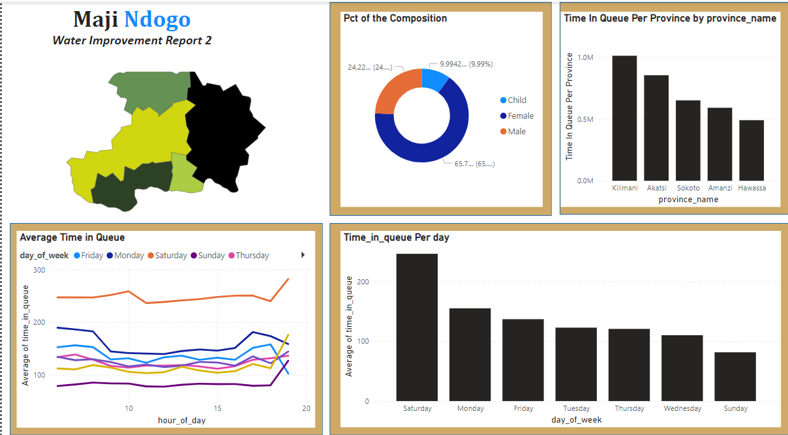

# Maji Ndojo National Water Survey Analysis
## Part 2: Moulding Data Into Visual Stories of Maji Ndogo
[Download_PowerBI_Report_Here](part_2.pbix)
***

***

### Contents
- [Project Overview](#project_overview)
- [Findings](Findings)

***

**Author**: 
* [Kelvin SIla](https://github.com/ksila01)
***
  
## Project_Overview
The next phase focuses on visualizing the data to gain a thorough understanding of the national survey results. This process includes generating visuals that involve calculating extra fields such as the average queue time per water source, categorizing sources based on basic or below-basic access, estimating costs for improvements, and mapping pollution, crime data, and water insights. These steps enhanced the data's value and depth of analysis.
***
**National Statistics**
<table>
  <tr>
    <td></td>
    <td></td>
  </tr>
  <tr>
    <td></td>
    <td></td>
  </tr>
</table>

**Findings**
* **64%** of the population (approximately 18 million people) live in rural areas, while **36%** (around 10 million people) live in urban areas. This indicates that the majority of the population relying on water resources is concentrated in rural areas, which may present unique challenges in terms of infrastructure and access.
* The population served by water sources consists of **69.06% female, 23.08% male, and 7.86% children**. This demographic breakdown shows a significant gender imbalance, with females forming the majority. This insight could indicate differences in accessibility or social roles related to water collection and usage.
* The most utilized water source is shared taps, serving over **60 million people**. In contrast, other sources like wells, rivers, and broken taps serve much fewer people. This highlights the reliance on shared infrastructure and possibly the need for improvement or expansion of water sources in the region.
* The provinces of Kilimani, Akatsi, and Sokoto show significant disparities between the percentages of males and females served.

**Water Queue Time Statistics**

**Findings**
* The report on water access in Maji Ndogo shows that average queue times are highest on Saturdays, peaking at over 200 minutes, while being lowest on weekdays, particularly on Wednesdays, with under 50 minutes.
* The time spent in queues tends to increase throughout the day, peaking around 6 PM, especially on weekends.
*  Additionally, there's a positive correlation between the number of people served and the average time in the queue, with larger crowds leading to wait times longer, sometimes exceeding 200 minutes.

**Water Related Crimes Statistics**

**Findings**

* The crime analysis report for Maji Ndogo reveals that Kilimani has the highest crime rate, accounting for 27.39% of the total crimes, followed by Sokoto at 24.21%. Harassment is the most prevalent crime type, particularly impacting female victims, with over 15,000 reported cases.
* The distribution of crime by gender and province shows that Kilimani and Akatsi have the highest numbers of male victim
